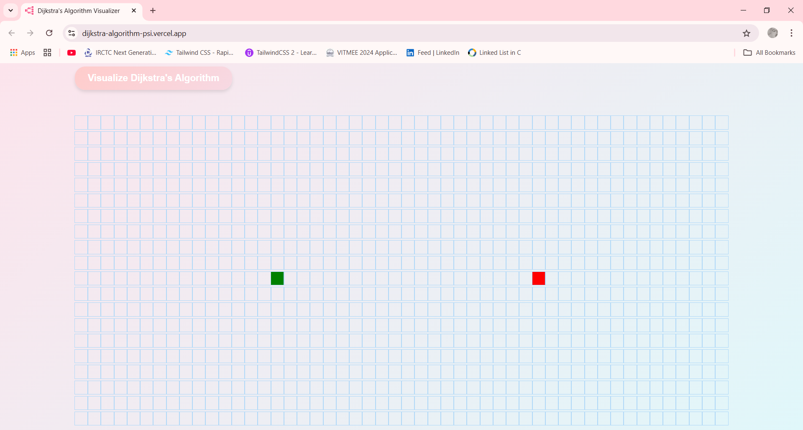
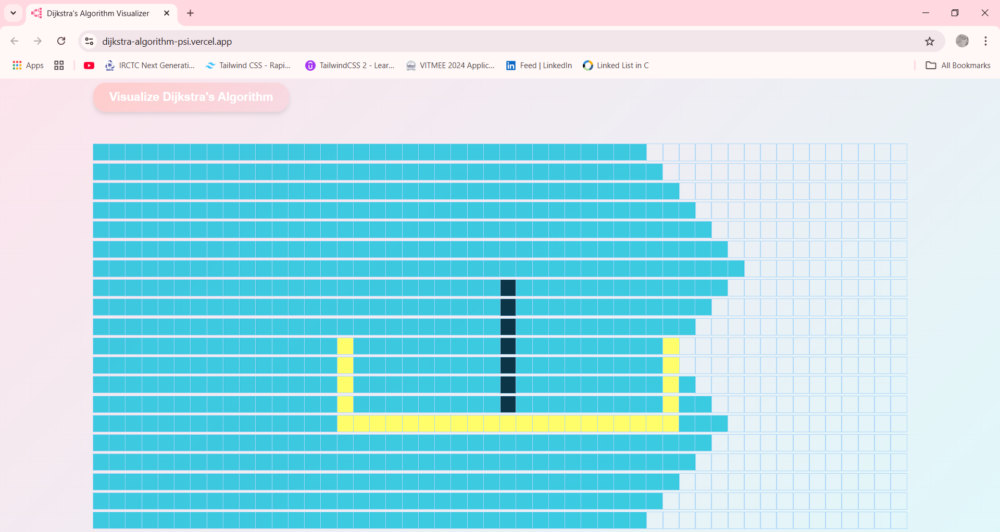

# Dijkstra's Algorithm - Pathfinding Visualizer

## Project Link: 
https://dijkstra-algorithm-psi.vercel.app/


## Screenshot




## Overview
This project visualizes **Dijkstra's Algorithm** to find the shortest path in a grid-based environment. Users can set start and end points, add obstacles, and observe the step-by-step execution of the algorithm.

## Features
- Interactive grid for placing start/end nodes and obstacles.
- Animated visualization of the algorithm's process.
- Customizable grid size and weights.

## Installation
1. Clone the repository:
   ```bash
   git clone https://github.com/your-username/dijkstras-algorithm-visualizer.git
   ```
2. Navigate to the project directory:
   ```bash
   cd dijkstras-algorithm-visualizer
   ```
3. Install dependencies:
   ```bash
   npm install
   ```
4. Start the application:
   ```bash
   npm start
   ```

## Usage
- Click to set start and end points.
- Drag to add obstacles.
- Click "Visualize" to see the algorithm in action.

## Contact
- GitHub: https://github.com/subhangee-1906
- Email: shubh190601@gmail.com

